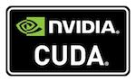
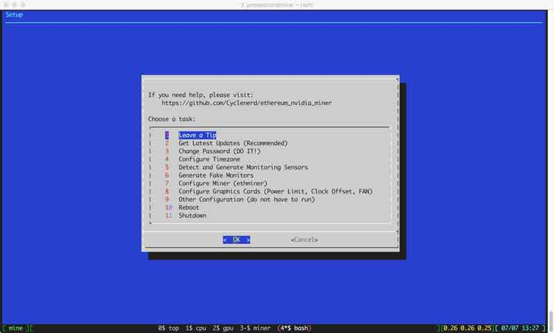
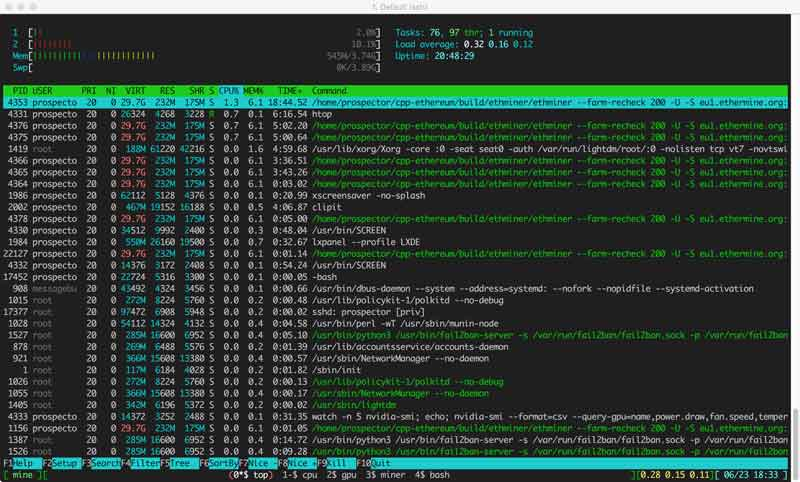
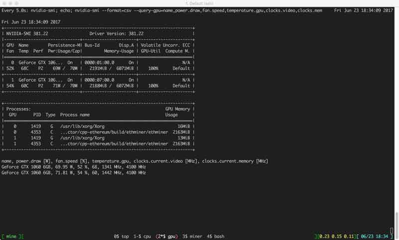
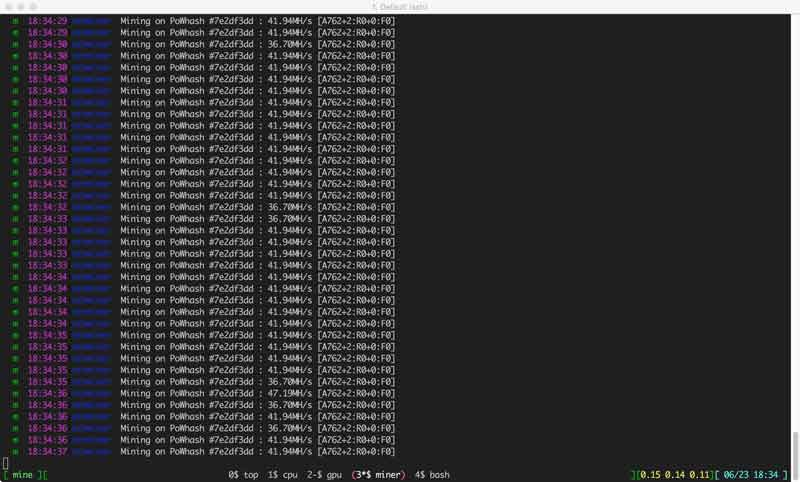
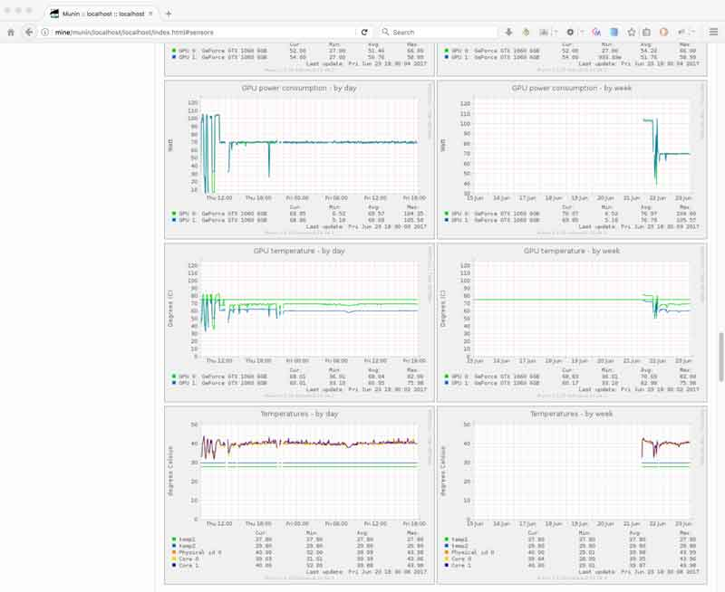
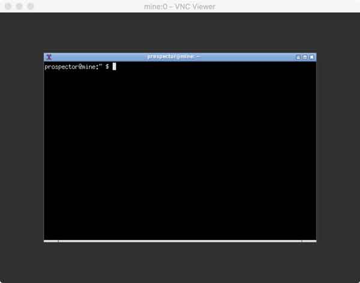

# Ethereum Mining with NVIDIA Graphics Cards and Ubuntu

**USB** flash drive **ISO** image for **Ethereum** mining with **NVIDIA** graphics cards and Ubuntu **GNU/Linux** (64-bit Intel/AMD (x86_64)).
Other cryptocurrencies, such as **Monero** or **Zcash**, can also be mined.




Press the 👁️ "Watch" button to get updates. Do not forget the  🌟 "Star" button 😀

🚨
**Use at your own risk.**
**Hope to help you.**
**Do not make me responsible for broken hardware.**
🚨

## Introduction

* This ISO image is based on 🐧 **Ubuntu 16.04.3 LTS (Server)**.
* **KISS**, keep it simple, stupid. Only the most necessary included. No 💩 bullshit.
* **NVIDIA** drivers version **390.25** installed.
* **CUDA 8** (`/usr/local/cuda-8.0`) and **CUDA 9.1** (`/usr/local/cuda-9.1`) ready to be used.
* [ethminer](https://github.com/ethereum-mining/ethminer) with the optimized code by [David Li](https://github.com/davilizh) (from NVIDIA) already compiled and ready for use.
	* The code is optimized for NVIDIA GTX 1060, can improve NVIDIA GTX 1060 with 2 GPC performance by 15%, and NVIDIA GTX 1060 with 1 GPC performance by more than 30%. Meanwhile, it also increases performance on NVIDIA GTX 1070.
* Claymore's dual miner version 10.6, XMR-Stak Monero miner and EWBF's Zcash miner are also included.
* Already configured to participate in the [ethermine](https://ethermine.org/) ethereum mining pool.
* The installation is optimized for operation **without monitor** (headless).
* No hard disk drive (HDD/SSD) required. Installation on USB flash drive.
* Created and **tested** with NVIDIA GeForce GTX 1060, NVIDIA GeForce GTX 1070 and NVIDIA GTX 1080.


## Navigation

* [Leave a Tip](#leave-a-tip-)
* [Installation](#installation)
	* [Download](#download)
		* [MD5](#md5)
	* [Copy](#copy)
		* [Windows](#windows)
		* [macOS](#-macos)
	* [Mainboard](#mainboard)
	* [Login](#login)
	* [Setup](#setup)
	* [Mine](#mine)
		* [miner.sh](#minersh)
	* [Overclocking](#overclocking)
		 * [With nvidia-overclock.sh (nvidia-settings)](#with--nvidia-overclocksh-nvidia-settings)
		 * [Why not use nvidia-smi?](#why-not-use-nvidia-smi)
 * [Other things you should do](#other-things-you-should-do)
	* [Update ethminer Ethereum Miner](#update-ethminer-ethereum-miner)
	* [Update Claymore's Dual Ethereum Miner](#update-claymores-dual-ethereum-miner)
	* [Update XMR-Stak Monero Miner](#update-xmr-stak-monero-miner)
	* [Update EWBF's CUDA Zcash Miner](#update-ewbfs-cuda-zcash-miner)
	* [Install ccminer CUDA Miner](#install-ccminer-cuda-miner)
 * [Wi-Fi WLAN](#wi-fi-wlan)
* [Monitoring](#monitoring)
	* [Munin](#munin)
	* [Fail2ban](#fail2ban)
	* [VNC](#vnc)
* [Help](#help-)
* [Known Issues](#known-issues)


## Leave a Tip 🙏

With this ISO image, you can immediately mine Ethereum (ETH).
Do not spend long time searching and researching.

I would be happy about a small donation. Thank you very much.

| Currency | Address                                      |
|----------|----------------------------------------------|
| Ethereum | `0xfbbc9f870bccadf8847eba29b0ed3755e30c9f0d` |
| Bitcoin  | `13fQA3mCQPmnXBDSmfautP4VMq6Sj2GVSA`         |


## Installation

If you do not trust me and do not want to use the image,
you will find all configuration files and scripts in the [files](https://github.com/Cyclenerd/ethereum_nvidia_miner/tree/master/files) folder.
You only have to install an Ubuntu Linux with all the drivers and tools yourself.

If you want to get started quickly, simply use the pre-configured ISO image
(contains the shell scripts, tools, and all necessary drivers).


### Download

Download the ISO image via BitTorrent (`ethereum-ubuntu-nvidia-miner_v3.img.7z.torrent`).
Compressed 1.8GB, unzipped 7.5GB.

[](https://github.com/Cyclenerd/ethereum_nvidia_miner/raw/master/ethereum-ubuntu-nvidia-miner_v3.img.7z.torrent)

#### MD5

It is recommended to test that the image is correct and safe to use.
The MD5 calculation gives a checksum, which must equal the MD5 value of a correct ISO image.

| Filename                               | MD5sum                             |
| -------------------------------------- |:----------------------------------:|
| ethereum-ubuntu-nvidia-miner_v3.img.7z | `af0b46286047534035e8834b65692334` |
| ethereum-ubuntu-nvidia-miner_v3.img    | `2ec9e5f871e6a89355006b1cac534859` |

More help is available here:
https://en.wikipedia.org/wiki/Md5sum


### Copy

1. Unzip the [7zip](http://www.7-zip.org/download.html) file `ethereum-ubuntu-nvidia-miner_v3.img.7z`.
2. Copy the image `ethereum-ubuntu-nvidia-miner_v3.img` to a at least 8GB USB flash drive.

Larger USB flash drive should also work.
I use the "Sandisk 32GB Ultra Fit USB 3.0 Flash Drive".

The copy can be done with `dd`.  ⚠️ The copy lasts long. Be patient.

How this works exactly is explained to you here:
https://wiki.archlinux.org/index.php/USB_flash_installation_media#Using_dd

#### Windows

Use the free and open source software [Rufus](https://rufus.akeo.ie/).
Simply select the ISO `ethereum-ubuntu-nvidia-miner_v3.img`, the USB drive you want to create the bootable Linux onto and click start.

Be sure to select DD mode or the image will be transferred incorrectly.

#### 🍎 macOS

Identify the disk (not partition) of your USB flash drive e.g. disk3:

    nils@macbookpro ~ $ diskutil list

Unmount your USB flash drive:

    nils@macbookpro ~ $ diskutil unmountDisk /dev/disk3

Copy the image to your USB flash drive:

    nils@macbookpro ~ $ sudo dd bs=1m if=Downloads/ethereum-ubuntu-nvidia-miner_v3.img of=/dev/rdisk3

Btw. `rdisk3` (with r) not `disk3` is not a write error.


### Mainboard

Set the primary graphics output to one of your NVIDIA cards.
Disable Secure Boot (UEFI) and boot from the USB flash drive.


### Login

The network configuration is done by DHCP. Look in your router which IP your miner has.

Connect via SSH with your miner.

    nils@macbookpro ~ $ ssh prospector@minerIP

Credentials. Password should be changed (`passwd`):

* 👤 Username: `prospector`
* 🔑 Password: `m1n1ng`


### Setup

There is an extra program which helps you with the initial setup. Type `setup` to start it.

    prospector@mine ~ $ setup



Go through __each__ step. If you have everything set you should do a `reboot`.


### Mine

After a minute uptime, a script (`screen`) starts automatically in the background, which starts the mining.

    prospector@mine ~ $ crontab -l
    
    # run screen after reboot
    @reboot sleep 60 && /usr/bin/screen -d -m

Enter `mine` to get it in the foreground:

    prospector@mine ~ $ mine

Use key combination <kbd>Ctrl</kbd> + <kbd>a</kbd>, and subsequently pressing a key to execute one of the commands given below:

* <kbd>n</kbd> : switches to the next available console
* <kbd>p</kbd> : switches back to the previous console
* <kbd>c</kbd> : creates a new virtual Bash console
* <kbd>d</kbd> : detaches the current screen sessions and brings you back to the normal terminal





More help is available here:
https://help.ubuntu.com/community/Screen

#### miner.sh

The `miner.sh` script starts automatically (`mine` console).
If you want to make settings that go beyond the `setup` program, you need to adjust it.
If you want to mine other cryptocurrencies, like Monero or Zcash, you also need to adjust this file.

    prospector@mine ~ $ nano -w miner.sh


### Overclocking

To pull the last MH/s out of your cards, you should overclock.

#### With  nvidia-overclock.sh (nvidia-settings)

Run the `nvidia-overclock.sh` to adjust the memory and graphics clock.
The settings are lost after a restart. You have to repeat it.

    prospector@mine ~ $ nvidia-overclock

For safety I did not add it in the autostart.
Sometimes you exaggerate when overclocking, and you'll be glad if a simple reboot helps.

If you are sure that everything works, you can add it to the autostart.
For security, it will start after 10 minutes.

    prospector@mine ~ $ crontab -e
    
    # After 10 minutes uptime, 'nvidia-overclock.sh' starts automatically
    # Only remove the comment if you are sure that everything works!!!
    #@reboot sleep 600 && bash ~/nvidia-overclock.sh >/dev/null 2>&1

You should experiment with the values and adjust the values in the script.
I wish you success 🤓

#### Why not use nvidia-smi?

nvidia-smi does not work with my cards (NVIDIA GeForce GTX 1060 and 1070).

    prospector@mine ~ $ nvidia-smi -i 0 -ac 4004,1987
    Setting applications clocks is not supported for GPU 0000:01:00.0.
    Treating as warning and moving on.
    All done.

No idea if this is a 🐛 bug. Have tried several drivers. Forums are full of bug reports.
With `nvidia-settings` I have no problems.

You can try it with your cards. It should work with Ti models. Here the text from the help:

    -ac, --applications-clocks=MEM_CLOCK,GRAPHICS_CLOCK

> Specifies maximum <memory,graphics> clocks as a pair (e.g. 2000,800) that defines GPU's speed while running applications on a GPU.


### Other things you should do


#### Update ethminer Ethereum Miner 

Update and recompile [ethminer](https://github.com/ethereum-mining/ethminer):

    prospector@mine ~ $ cd ~/ethereum-mining/ethminer
    prospector@mine ethminer $ git pull
    prospector@mine ethminer $ cd build/
    prospector@mine build $ cmake -D CUDA_TOOLKIT_ROOT_DIR=/usr/local/cuda-9.1 ..
    prospector@mine build $ cmake --build . --config release


#### Update Claymore's Dual Ethereum Miner 

Download the [latest version](https://bitcointalk.org/index.php?topic=1433925.0) Claymore's Dual Ethereum miner for Linux and copy it to your USB flash driver.
The copy can be done via SCP.

On Windows, you can use [FileZilla](https://filezilla-project.org/) or [WinSCP](https://winscp.net/).
On Linux and macOS it works like this:

```
nils@macbookpro ~ $ scp "Claymore's Dual GPU Miner - LINUX.tar.gz" prospector@minerIP:/home/prospector/
```

Unpack the tar.gz file into the `~/claymore-dual-miner` folder:

```
prospector@mine ~ $ tar xvfz "Claymore's Dual GPU Miner - LINUX.tar.gz" -C ~/claymore-dual-miner --strip-components=1
```


#### Update XMR-Stak Monero Miner

Update and recompile [XMR-Stak](https://github.com/fireice-uk/xmr-stak):

```
prospector@mine:~ $ cd ~/monero-mining/xmr-stak/
prospector@mine:~/monero-mining/xmr-stak $ git pull
prospector@mine:~/monero-mining/xmr-stak $ nano -w xmrstak/donate-level.hpp # Edit donation fee 
prospector@mine:~/monero-mining/xmr-stak $ cd build/
prospector@mine:~/monero-mining/xmr-stak/build $ cmake -DXMR-STAK_COMPILE=generic -D CUDA_TOOLKIT_ROOT_DIR=/usr/local/cuda-9.1 -DOpenCL_ENABLE=OFF ..
prospector@mine:~/monero-mining/xmr-stak/build $ make install
```
Select the CPU compute architecture:

* `-DXMR-STAK_COMPILE=generic` = the miner can be used on all CPU's with sse2
* `-DXMR-STAK_COMPILE=native`  = the miner can be used only on the system where it is compiled but will archive the highest hash rate


#### Update EWBF's CUDA Zcash Miner

Download the [latest version](https://bitcointalk.org/index.php?topic=1707546.0) EWBF's CUDA Zcash miner for Linux and copy it to your USB flash driver.
The copy can be done via SCP.

On Windows, you can use [FileZilla](https://filezilla-project.org/) or [WinSCP](https://winscp.net/).
On Linux and macOS it works like this:

```
nils@macbookpro ~ $ scp "Zec Miner Linux Bin.tar.gz" prospector@minerIP:/home/prospector/
```

Unpack the tar.gz file into the `~/zcash-mining/ewbf/` folder:

```
prospector@mine ~ $ tar xvfz "Zec Miner Linux Bin.tar.gz" -C ~/zcash-mining/ewbf/ --strip-components=1
```


#### Install ccminer CUDA Miner

Compile [ccminer](https://github.com/tpruvot/ccminer):

```
prospector@mine:~ $ sudo apt-get install libcurl4-openssl-dev libssl-dev libjansson-dev automake autotools-dev build-essential
prospector@mine:~ $ sudo ln -s /usr/local/cuda-8.0 /usr/local/cuda
prospector@mine:~ $ git clone https://github.com/tpruvot/ccminer.git
prospector@mine:~ $ cd ccminer
prospector@mine:~/ccminer $ git checkout linux
prospector@mine:~/ccminer $ ./build.sh
prospector@mine:~/ccminer $ ./ccminer --version
```


### Wi-Fi WLAN

The `wpa_supplicant` package, which includes the main program `wpa_supplicant` and the passphrase tool `wpa_passphrase` are already installed.

This method allows quickly connecting to a wireless network whose SSID is already known, making use of `wpa_passphrase`, a command line tool which generates the minimal configuration needed: 

    prospector@mine ~ $ sudo wpa_passphrase "SSID" "WPA2-KEY" > /etc/wpa_supplicant/wpa_supplicant.conf

Test configuration:

    prospector@mine ~ $ sudo wpa_supplicant -i wlan0 -D wext -c /etc/wpa_supplicant/wpa_supplicant.conf -d

To enable Wi-Fi on the next reboot, remove the comments in the file `/etc/network/interfaces`:

    prospector@mine ~ $ sudo nano -w /etc/network/interfaces
    prospector@mine ~ $ reboot

More help is available here:
https://wiki.archlinux.org/index.php/WPA_supplicant


## Monitoring

Of course, with SSH.


### Munin

`munin` and the `lighttpd` web server are also installed. You can use it to access statistics pages.

    http://minerIP/munin

Here you can find diagrams of the sensors, etc.




### Fail2ban

Fail2ban is installed.
The program monitors logins via SSH. Too many false logins from an IP and the IP is blocked.
At each start (reboot) and block you will receive an e-mail.
You should check your e-mails from time to time.

    prospector@mine ~ $ mutt

More help is available here:
https://help.ubuntu.com/community/Fail2ban


### VNC

Start `x11vnc` server.

    prospector@mine ~ $ x11vnc

Enter the IP address and display in VNC Viewer to establish a direct connection. For example:

    minerIP:0




## Help 👍

If you have found a bug (English is not my mother tongue) or have any improvements, send me a pull request.

### Commits, Comments & Pull requests

I like to have _elementary_ commits as it is much easier to manage for reviewing and debugging. 
So please **don't** be afraid to make **as many** commits as needed.
Merging many commits is as easy as merging one, if not easier.
Pull requests can regroup many commits at once.
Just try to explain in the pull comment the ''why'' I should merge it (if it's not obvious).
Please do not try to summarize several big changes (new features) in one pull.

And a few more things:

* Variables must be uppercase and must begin with `MY_`.
* Functions must be lower case and must begin with `my_`.
* Check your shell scripts with [ShellCheck](https://www.shellcheck.net/) before submitting.
* Please use four spaces to indent.

## Known Issues

NVIDIA tools (especially `nvidia-smi`) seems to be lagging on 7 GPU rigs, 
crashing the system and/or causing some system instabilities.
Issue reproduced on two different 7 GPUs rigs (different motherboard & GPU brands).
Six graphics cards work without problems.

NVIDIA GeForce GTX 1050 Ti does not have Performance Level 3 (only Level 2) thus `nvidia-overclock.sh` has to be changed (change [3] with [2]).

